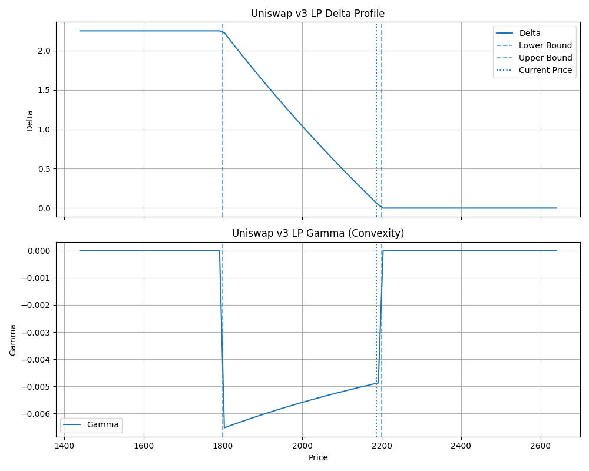

# DeFi Convexity Risk Engine

## Overview

This project models the risk profile of Uniswap v3 liquidity provision using a quantitative finance framework.

It analyzes LP positions as nonlinear financial instruments and evaluates their sensitivities (Delta, Gamma), convexity exposure, and jump risk under different market scenarios.

The model integrates real-time market data and provides a structured way to assess whether fee income compensates for risk.

---

## Key Insight

> Providing liquidity in Uniswap v3 is economically equivalent to selling a volatility strangle.

LPs earn fees (premium) but are exposed to losses during large price movements due to negative convexity.

---

## Core Idea

Providing liquidity in concentrated AMMs can be interpreted as **selling convexity (short gamma)**:

- LPs continuously rebalance inventory as price moves  
- This creates nonlinear exposure to price changes  
- Losses occur during high volatility regimes  

> LPing is not passive yield — it is a short volatility strategy.

---

## What I Built

- Piecewise valuation model for Uniswap v3 LP positions  
- Analytical Delta and Gamma computation across price ranges  
- Scenario-based PnL engine (bear / base / bull)  
- Jump-risk estimation via Poisson arrival process  
- Risk/Reward metric comparing expected loss vs fee income  
- Real-time ETH price integration via CoinGecko API  

---

## Risk Visualization

The following chart shows the local Delta and Gamma across price levels:

### Interpretation

- **Delta** decreases as price increases due to inventory rebalancing  
- **Gamma** is negative within the active range → LP is short convexity  
- Outside the range, Gamma approaches zero as liquidity becomes inactive  

---

## Example Output

The engine produces a convexity dashboard across market scenarios:

| Scenario | Price | Value | Delta | Gamma | Expected Loss | Fees | Risk/Reward |
|----------|------|------|------|------|---------------|------|-------------|
| Bear     | ↓    | ↓    | ↑    | -    | High Loss     | Low  | High        |
| Base     | →    | →    | Mid  | -    | Medium Loss   | Low  | Medium      |
| Bull     | ↑    | →    | 0    | 0    | Low Loss      | Low  | Low         |

---

## Methodology

The LP position is modeled using Uniswap v3 liquidity mechanics:

- Token0 / token1 decomposition of LP value  
- Delta = ∂V/∂P  
- Gamma = ∂²V/∂P²  
- Scenario PnL under price shocks  
- Jump risk modeled via Poisson arrival probability  
- Expected loss compared against estimated fee income  

---

## Why It Matters

DeFi yield is often presented as passive income.

This model shows that LP returns are primarily driven by:

- price path  
- volatility  
- convexity exposure  

> Risk, not yield, is the dominant driver of LP outcomes.

---

## Future Work

* Historical backtesting with real price data
* Dynamic rebalancing strategies
* Integration with on-chain data (Dune, APIs)
* Streamlit dashboard for real-time monitoring

## Convexity Profile of a Uniswap v3 LP

The following chart illustrates the local Delta and Gamma of a concentrated liquidity position.

Key observations:
- Delta decreases with price due to inventory rebalancing
- Gamma is strictly negative within the active range
- The LP is effectively short volatility

---
## Limitations
- simplified jump specification
- no full calibration to market data yet
- no on-chain data pipeline yet

## Roadmap
- historical backtesting
- dynamic rebalancing strategies
- on-chain data integration
- Streamlit dashboard

## Author

DeFi Quant Analyst focused on AMM risk, convexity, and yield modeling.
