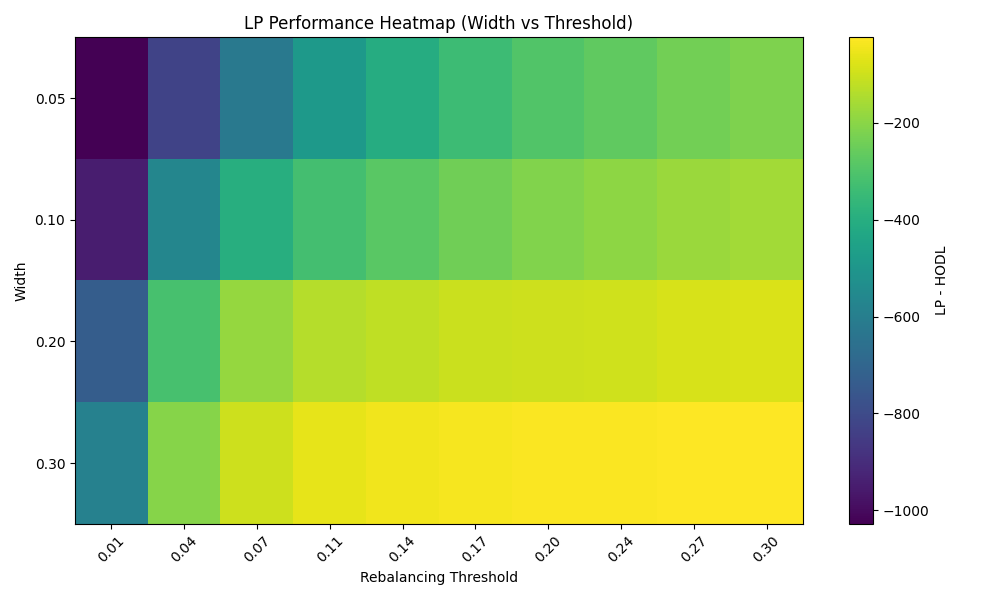
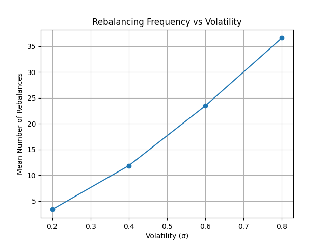
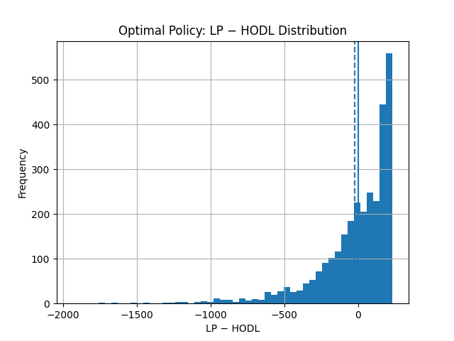
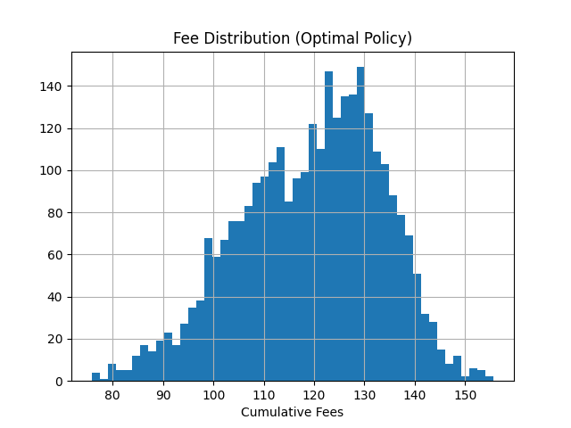
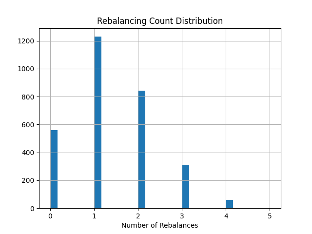

# DeFi Convexity Risk Engine

## Overview

This project studies **Uniswap v3 liquidity provision as a convexity-selling strategy** and builds a **Monte Carlo framework for LP strategy optimization**.

It combines:

- convexity and impermanent loss (IL) analysis  
- LP vs HODL simulation  
- dynamic rebalancing with transaction costs  
- risk-adjusted optimization of LP range width  

The project evolves from **risk measurement → strategy design**, with the goal of identifying **robust, decision-grade LP strategies**.

---

## Key Insight

> Providing liquidity in Uniswap v3 is economically equivalent to selling a volatility strangle.

LPs earn fees (premium) but are exposed to nonlinear losses during large price movements due to **negative convexity**.

---

## Core Economic Idea

Providing liquidity in concentrated AMMs can be interpreted as **selling convexity (short gamma)**:

- LP inventory is continuously rebalanced as price moves  
- this creates nonlinear exposure to price changes  
- losses materialize in trending or high-volatility regimes  

> LPing is not passive yield — it is a **short-volatility strategy**.

---

## Convexity & Impermanent Loss

### Convexity Profile

- Delta decreases as price moves due to inventory rebalancing  
- Gamma is strictly negative within the active range  
- Outside the range, Gamma → 0 (inactive liquidity)  

---

### Convexity Cost (LP − HODL)

- Near entry: LP ≈ HODL  
- Large moves: LP underperforms nonlinearly  
- Loss grows with price deviation  

> **LP − HODL = cost of short convexity**

---

### LP vs HODL Payoff

- HODL → linear payoff  
- LP → concave payoff  
- Underperformance in trends  

---

### Simulation: Distribution of Outcomes

- HODL → higher variance + upside  
- LP → compressed distribution  
- LP trades tail risk for fee income  

---

## Fee vs Convexity Trade-off

LP profitability depends on:

- **Fee income (positive carry)**  
- **Convexity cost (negative drift)**  

| Market Regime | Outcome |
|--------------|--------|
| Range-bound + high volume | LP profitable |
| Trending / high volatility | LP underperforms |

> LP is a **volatility-harvesting strategy**.

---

## Strategy Optimization (Main Contribution)

We extend the framework from risk analysis to **strategy design**.

### Objective

Optimize:

- LP range width  
- rebalancing policy  

to maximize:

> **Expected (Fees − IL − Costs)**

under stochastic price dynamics.

---

## Model Setup

### Price Process

- Geometric Brownian Motion (GBM)  
- σ ∈ {0.2, 0.4, 0.6, 0.8}  
- Monte Carlo simulation  

---

### Strategy Specification

- log-symmetric LP ranges (5% → 30%)  
- dynamic rebalancing (out-of-range trigger)  
- segment-based IL realization  
- explicit gas + slippage costs  

---

### Transaction Costs

- fixed gas cost  
- slippage ∝ capital / width  

→ narrow ranges are more expensive to maintain  

---

### Impermanent Loss (Key Improvement)

IL is modeled **locally**:

- measured vs last rebalance price  
- resets at each rebalance  
- becomes **strategy-dependent**

---

## Optimization Results

### Optimal Width vs Volatility

| Volatility (σ) | Optimal Width |
|----------------|--------------|
| 0.2 | ~20% |
| 0.4 | ~16–20% |
| 0.6 | ~20% |
| 0.8 | ~18–22% |

> Optimal width lies in a **stable 15–22% band**

---

### Performance vs Volatility

- LP outperformance increases with volatility  
- driven by higher fee generation  

---

### Fee vs Width

- narrower ranges → higher fee density  
- diminishing returns at extreme narrow widths  

---

## Robustness Analysis

### Transaction Costs

| Gas | Slippage | Optimal Width |
|-----|----------|---------------|
| Low | Low | ~14% |
| Medium | Medium | ~20% |
| High | High | ~30% |

→ higher friction → wider optimal ranges  

---

### Stability

Strategy remains robust across:

- volatility regimes  
- random seeds  
- time horizons  

---

## Martingale Insight (Key Theoretical Result)

Under zero fees:

> **LP − HODL is a supermartingale**

- negative expected drift  
- driven by concavity (short gamma)  

With fees:

- a positive drift term is introduced  
- profitability depends on:
  - volatility  
  - costs  
  - rebalancing  

> Strategy design = **controlling convexity so drift ≥ 0**

---

## Final Strategy

We select:

- **Width:** ~20%  
- **Rebalance:** out-of-range  
- **Capital:** fixed  
- **Costs:** explicit  

### Result

- Outperforms HODL in majority of paths  
- High variance  
- Sensitive to volatility  

> LP is a **risk-managed volatility harvesting strategy**, not a guaranteed outperformer.

---

## Final Strategy

We select:

- **Width:** ~20%  
- **Rebalance:** out-of-range  
- **Capital:** fixed  
- **Costs:** explicit  

### Result

- Outperforms HODL in majority of paths  
- High variance  
- Sensitive to volatility  

> LP is a **risk-managed volatility harvesting strategy**, not a guaranteed outperformer.

---

## Additional Results: Threshold Rebalancing, Volatility, and Final Policy Diagnostics

The initial strategy comparison above is further refined by replacing discrete rebalancing policies with a **continuous rebalancing threshold**. This allows the project to move from policy comparison to actual strategy design.

### Rebalancing Threshold (Refined Definition)

Let \( S_t \) denote the asset price and let \( S_{\tau_k} \) be the reference price at the most recent rebalance time \( \tau_k \). We define the **rebalancing threshold** \( \delta \in (0,1) \) as the relative deviation that triggers a reset:

\[
\left| \frac{S_t}{S_{\tau_k}} - 1 \right| \ge \delta.
\]

Operationally, when this condition is met:

- the LP position is re-centered at the current price,  
- local impermanent loss is reset relative to the new center,  
- accumulated fees are preserved,  
- transaction costs are incurred.

Smaller thresholds correspond to **more reactive** strategies with higher turnover, while larger thresholds correspond to **more passive** strategies that tolerate larger price excursions before rebalancing.

### Width–Threshold Joint Optimization

To evaluate the interaction between **structural convexity control** (width) and **timing control** (threshold), the project performs a joint width–threshold sweep.

This refined optimization confirms that:

- **width** is the dominant structural control on convexity exposure,  
- **threshold** determines how often convexity losses are realized,  
- aggressive rebalancing cannot eliminate convexity drag and, in the presence of costs, often worsens outcomes by realizing losses more frequently

The refined objective remains consistent with the project’s core decomposition:

\[
\text{LP PnL} \approx \text{fees} - \text{convexity drag} - \text{costs}.
\]

In this interpretation:

- **fees** are the positive carry from order flow,  
- **convexity drag** is the Jensen-gap / short-gamma component of LPing,  
- **costs** arise from gas, slippage, and discrete implementation.

---

## Volatility, Rebalancing Frequency, and Realized Convexity

A further refinement of the analysis treats rebalancing frequency as an **endogenous consequence of volatility** rather than a free control variable.

Holding width and threshold fixed, increasing volatility raises the probability of hitting the rebalance boundary, and therefore increases the number of stopping times at which the position is reset.

This provides a direct interpretation of rebalancing frequency as a proxy for **realized convexity pressure**:

- higher volatility → more threshold crossings,  
- more threshold crossings → more frequent realization of convexity losses,  
- more frequent realization → higher cumulative implementation costs.

In the current model (GBM dynamics with transaction costs), volatility therefore has a dual effect:

- it increases fee generation,  
- but it also accelerates convexity realization and turnover.

The simulations show that in high-volatility regimes, the second effect dominates: fee income rises, but convexity losses and costs increase faster, leading to systematic deterioration in LP − HODL outcomes.

---

## Optimal Policy Diagnostics

The final optimal-policy simulation summarizes the distributional structure of the least-adverse strategy found in the model.

### Terminal LP − HODL Distribution

The terminal distribution of LP − HODL is highly asymmetric:

- most simulated paths produce **small positive outcomes**,  
- a minority of paths generate **very large losses**,  
- these rare losses dominate the expectation.

This is the characteristic signature of a **short-volatility / short-convexity strategy**: many small gains from fees, offset by rare but severe downside during large price moves.

### Fee Distribution

Fee income is comparatively stable and concentrated, indicating that the extreme dispersion in LP outcomes is not primarily driven by unstable fee generation, but by the nonlinear exposure of LP to large price dislocations.

### Rebalancing Count Distribution

The rebalance-count distribution confirms that the selected policy is **sparse** rather than hyperactive: most paths require only a small number of resets, and many paths require none or only one rebalance. This is consistent with the broader conclusion that frequent rebalancing is not an effective cure for convexity drag under transaction costs.

---

## Final Distributional Result

For the selected optimal-policy simulation:

- **Mean LP − HODL:** −19.74  
- **Standard deviation:** 269.74  
- **Probability(LP > HODL):** 59.5%  
- **Mean cumulative fees:** 119.4  
- **Mean rebalances:** 1.36  

This result captures the central paradox of the project:

> LP outperforms HODL in a majority of simulated paths, yet the average LP − HODL remains negative.

The explanation is structural:

- **small, frequent gains** come from fee income,  
- **rare, large losses** come from convexity / impermanent loss,  
- tail losses dominate the expectation.

The project therefore does **not** identify a genuinely profitable LP strategy under the modeled assumptions (GBM dynamics, fee model, and costs). Instead, it identifies the **least bad implementation** of a structurally short-convexity position.

---

## Updated Practical Interpretation

Within this stylized framework, the least-adverse LP configuration is characterized by:

- **wide or moderate ranges**,  
- **sparse rebalancing**,  
- reliance on **fee flow** rather than frequent convexity hedging,  
- explicit acceptance of **left-tail risk**.

The main design conclusion is therefore not that active management creates alpha, but that LP risk can be managed only partially. Width is the main structural lever, while rebalancing should be used conservatively to avoid unnecessary realization of convexity losses and transaction costs.

In this sense, concentrated liquidity provision is best understood as a **controlled short-convexity strategy**: it can be optimized, but not transformed into a structurally risk-free source of outperformance.

## Project Structure
src/
├── stochastic/ # price, fees, LP simulation
├── strategy/ # Uniswap v3 strategy logic
├── optimization/ # grid search & objective
├── analysis/ # LP − HODL, martingale tests

---

## Limitations

- GBM price model  
- simplified liquidity math  
- no endogenous order flow  
- fixed fee tier  

---

## Future Work

- historical backtesting  
- multi-range LP strategies  
- order-flow driven volume  
- on-chain data integration  
- dashboard / API layer  

---

## Author

Gennaro Cepparulo  
Quantitative research on AMM risk, convexity, and LP strategy design
